# AI Sales Intelligence Assistant - Screenshots

This document contains the implementation screenshots of the **AI Sales Intelligence Assistant**, developed by **AI Weekline**.

---

# Workflow Architecture

### Complete Automation Workflow

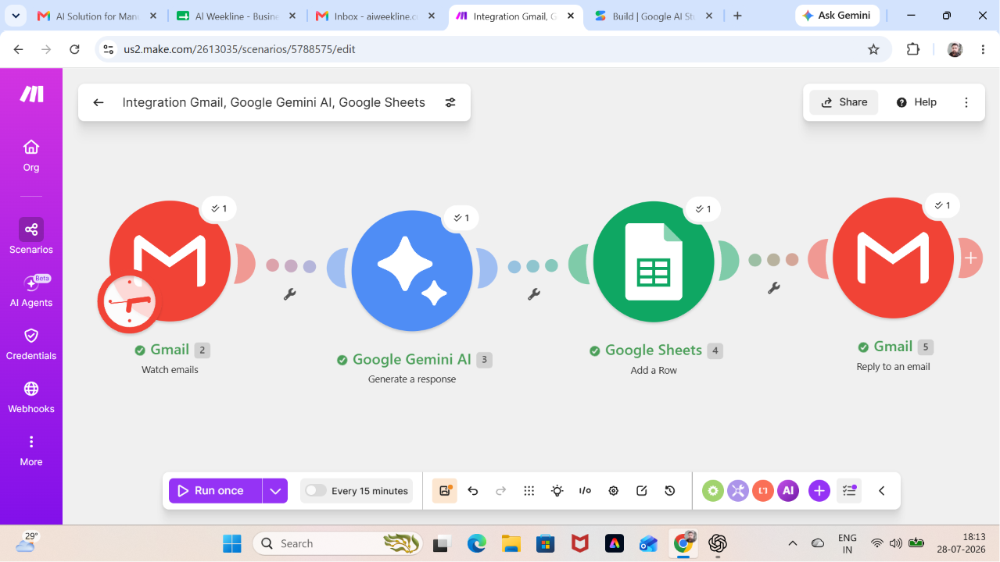

---

# Customer 01

## Customer Email

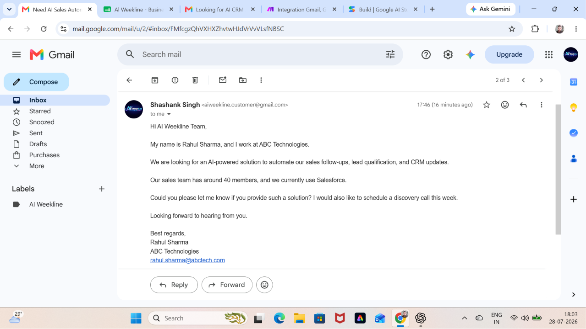

## AI Generated Reply

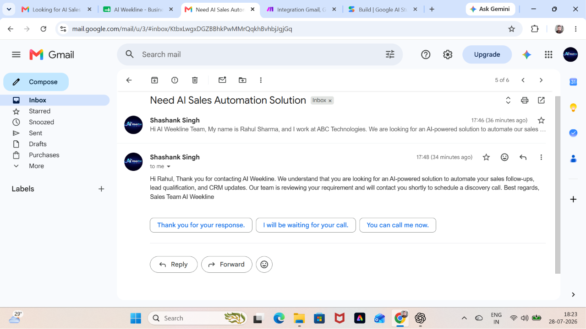

---

# Customer 02

## Customer Email

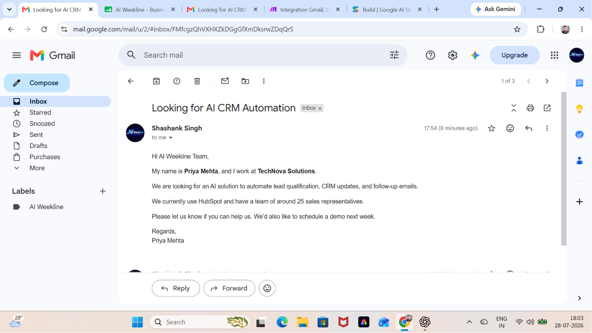

## AI Generated Reply

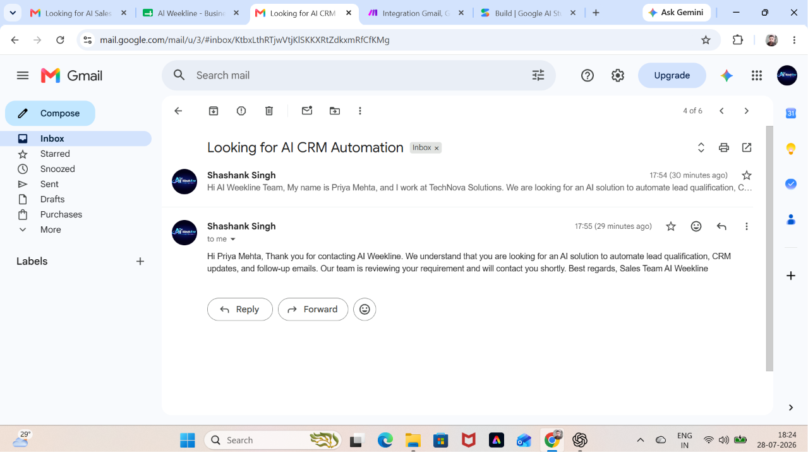

---

# Customer 03

## Customer Email

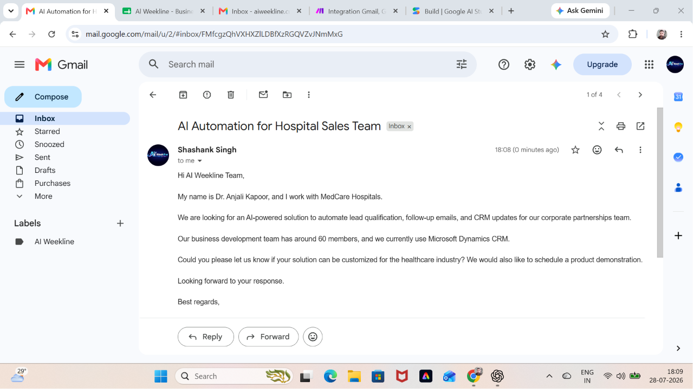

## AI Generated Reply

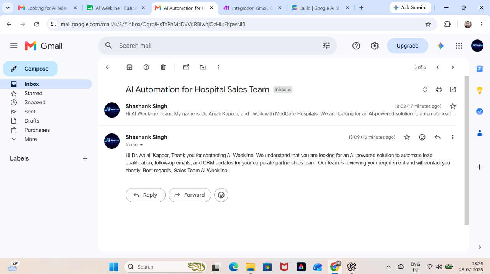

---

# Customer 04

## Customer Email

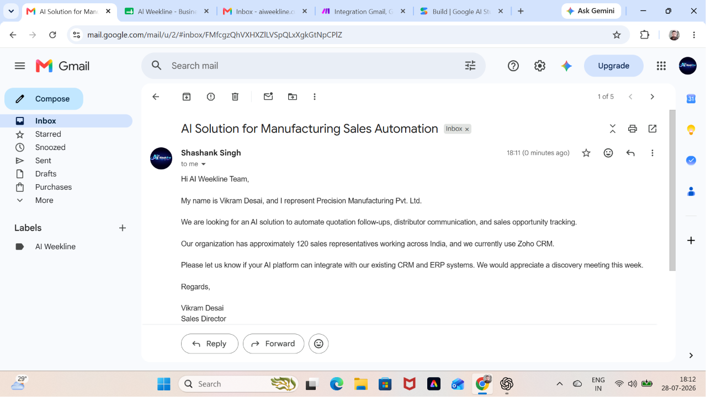

## AI Generated Reply

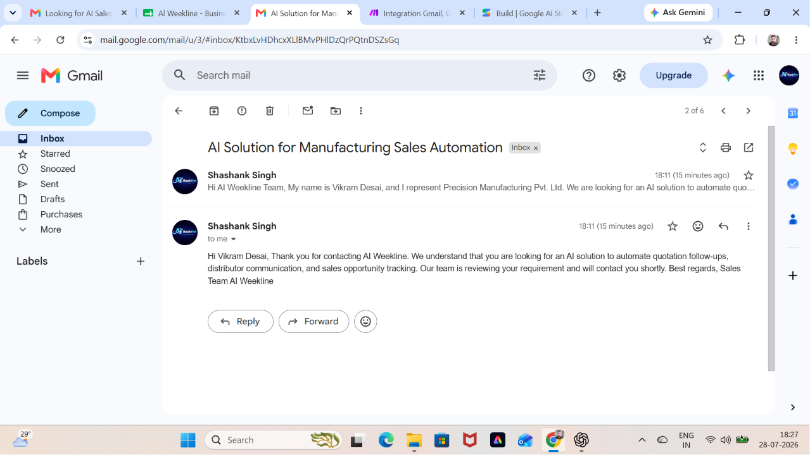

---

# Customer 05

## Customer Email

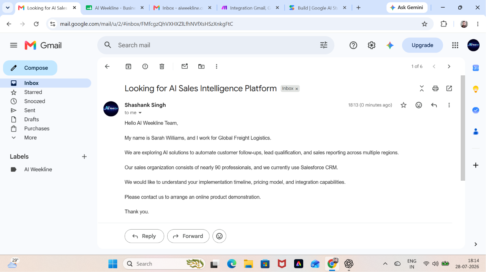

## AI Generated Reply

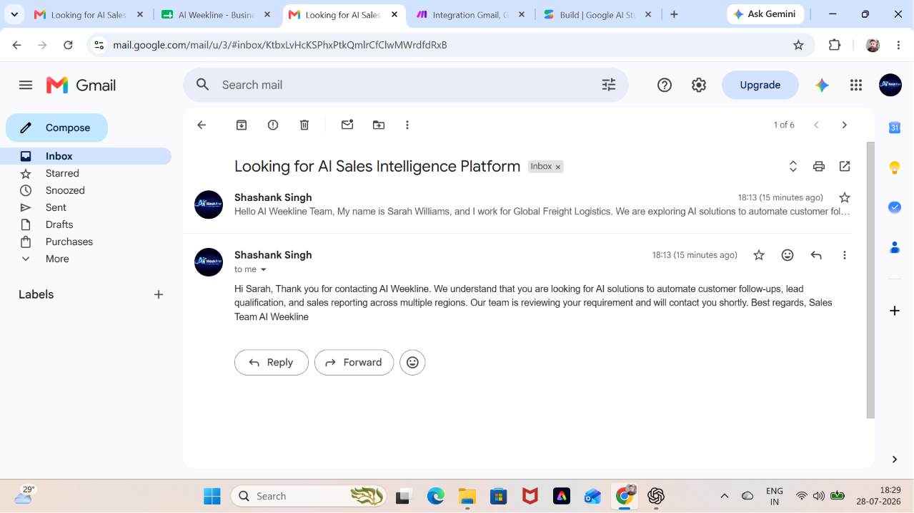

---

# Google Sheets Test Results

## Part 1

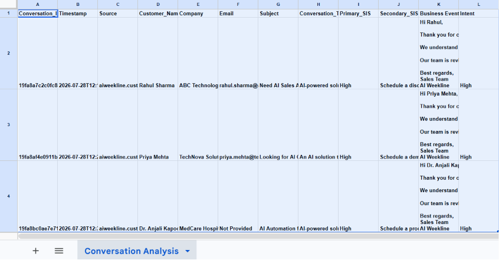

## Part 2

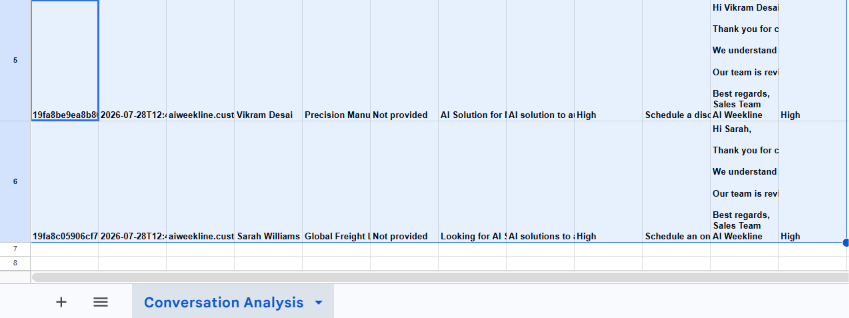

---

# Summary

The screenshots above demonstrate the complete implementation of the AI Sales Intelligence Assistant, including:

- Workflow Automation using Make.com
- Gmail Integration
- Google Gemini AI Processing
- AI Generated Customer Responses
- Google Sheets Data Storage
- End-to-End Customer Test Cases
- Production-ready Workflow Execution

Developed by **AI Weekline**.
